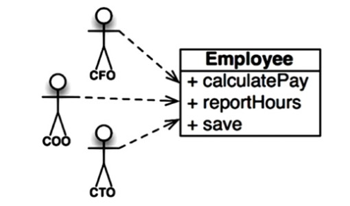
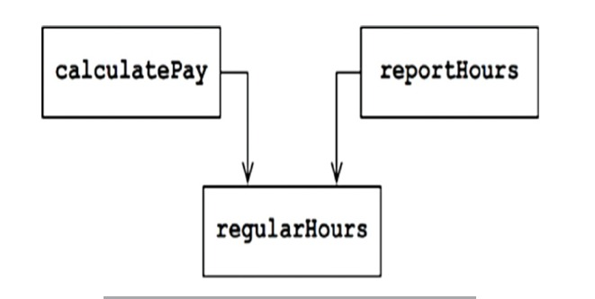

# Single Responsibility Principle

We use that principle when we are refactoring large
functoins into smaller functions. We use it at the lowest
levels. But it is not one of the SOLID principles.

Violating it:

Symptom 1: Accidental Duplicatte

This class violates the SRP because those three methods are
resposible to three very different actors

* The calculatePay() method is specified by the accounting
department, which reports to the CFO.

* The reportHours() method is specified and used by the
human resources department, which reports to the COO.

* The save() method is specified by the database
administrators (DBAs), who report to the CTO.

By putting the source code for these three methods into a single
Employee class, the developers have coupled each of these
actors to the others. This coupling can cause the actions of the
CFO’s team to affect something that the COO’s team depends
on.

For example, suppose that the calculatePay() function and
the reportHours() function share a common algorithm for
calculating non-overtime hours. Suppose also that the
developers, who are careful not to duplicate code, put that
algorithm into a function named regularHours()

Now suppose that the CFO’s team decides that the way nonovertime hours are calculated needs to be tweaked. In contrast,
the COO’s team in HR does not want that particular tweak
because they use non-overtime hours for a different purpose.

A developer is tasked to make the change, and sees the
convenient regularHours() function called by the
calculatePay() method. Unfortunately, that developer does
not notice that the function is also called by the
reportHours() function.

The developer makes the required change and carefully tests it.
The CFO’s team validates that the new function works as
desired, and the system is deployed.
j
Of course, the COO’s team doesn’t know that this is happening.
The HR personnel continue to use the reports generated by the
reportHours() function—but now they contain incorrect
numbers. Eventually the problem is discovered, and the COO is
livid because the bad data has cost his budget millions of
dollars.

We’ve all seen things like this happen. These problems occur
because we put code that different actors depend on into close
proximity. 

The SRP says to separate the code that different
actors depend on

Solutions:

## References

Clean Architecture by Robert C Martin
